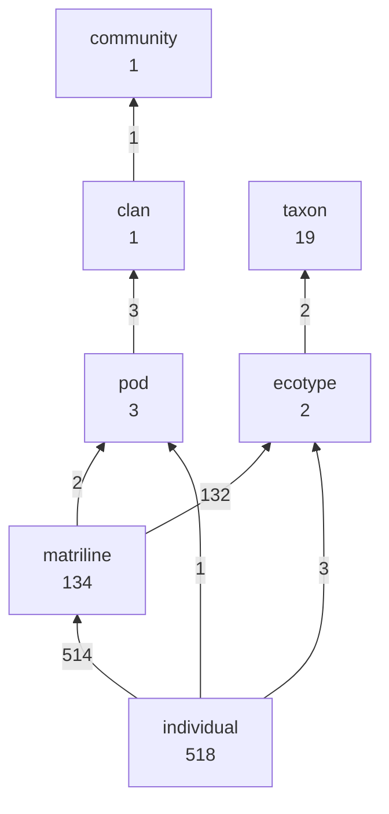
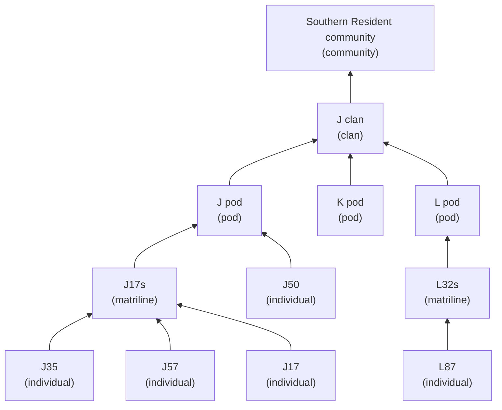

# The shape of the register

Generated by `bin/validate.py --write-dist`. Not hand-edited.

## Rank structure

Every membership edge, collapsed to the level of the things it connects.
Edge labels are edge counts; node labels are how many entities exist at that
level. A level with no path upward is a break in the graph.

> **12 entities are unreachable from any species.** Follow the
> arrows up: a level with no outgoing edge is where the graph breaks, and
> everything below it falls out of every rollup.

## Southern Residents

The seeded branch in full — small enough to render whole.

