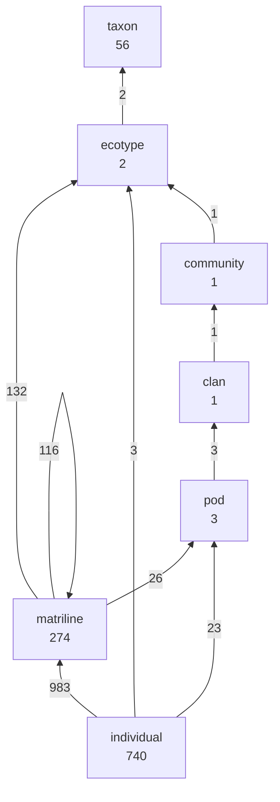

# The shape of the register

Generated by `bin/validate.py --write-dist`. Not hand-edited.

## Rank structure

Every membership edge, collapsed to the level of the things it connects.
Edge labels are edge counts; node labels are how many entities exist at that
level. A level with no path upward is a break in the graph.


```mermaid
graph BT
  clan["clan<br/>1"]
  community["community<br/>1"]
  ecotype["ecotype<br/>2"]
  individual["individual<br/>740"]
  matriline["matriline<br/>274"]
  pod["pod<br/>3"]
  taxon["taxon<br/>56"]
  individual -->|983| matriline
  matriline -->|132| ecotype
  matriline -->|116| matriline
  matriline -->|26| pod
  individual -->|23| pod
  individual -->|3| ecotype
  pod -->|3| clan
  ecotype -->|2| taxon
  clan -->|1| community
  community -->|1| ecotype
```

## Residents

The seeded branch in full — small enough to render whole.

```mermaid
graph BT
  SSA_0000003["Resident<br/>(ecotype)"]
  SSA_0000010["Southern Resident<br/>(community)"]
  SSA_0000011["J clan<br/>(clan)"]
  SSA_0000020["J pod<br/>(pod)"]
  SSA_0000021["K pod<br/>(pod)"]
  SSA_0000022["L pod<br/>(pod)"]
  SSA_0000030["J17s<br/>(matriline)"]
  SSA_0000031["L32s<br/>(matriline)"]
  SSA_0000101["J35<br/>(individual)"]
  SSA_0000102["J57<br/>(individual)"]
  SSA_0000103["J50<br/>(individual)"]
  SSA_0000104["L87<br/>(individual)"]
  SSA_0000105["J17<br/>(individual)"]
  SSA_0003000["J4s<br/>(matriline)"]
  SSA_0003001["J5s<br/>(matriline)"]
  SSA_0003002["J10s<br/>(matriline)"]
  SSA_0003003["J11s<br/>(matriline)"]
  SSA_0003004["J12s<br/>(matriline)"]
  SSA_0003005["J14s<br/>(matriline)"]
  SSA_0003006["J16s<br/>(matriline)"]
  SSA_0003007["J19s<br/>(matriline)"]
  SSA_0003008["J20s<br/>(matriline)"]
  SSA_0003009["J22s<br/>(matriline)"]
  SSA_0003010["J28s<br/>(matriline)"]
  SSA_0003011["J31s<br/>(matriline)"]
  SSA_0003012["J35s<br/>(matriline)"]
  SSA_0003013["J36s<br/>(matriline)"]
  SSA_0003014["J37s<br/>(matriline)"]
  SSA_0003015["J40s<br/>(matriline)"]
  SSA_0003016["J41s<br/>(matriline)"]
  SSA_0003017["J42s<br/>(matriline)"]
  SSA_0003018["K3s<br/>(matriline)"]
  SSA_0003019["K4s<br/>(matriline)"]
  SSA_0003020["K7s<br/>(matriline)"]
  SSA_0003021["K8s<br/>(matriline)"]
  SSA_0003022["K11s<br/>(matriline)"]
  SSA_0003023["K12s<br/>(matriline)"]
  SSA_0003024["K13s<br/>(matriline)"]
  SSA_0003025["K14s<br/>(matriline)"]
  SSA_0003026["K16s<br/>(matriline)"]
  SSA_0003027["K18s<br/>(matriline)"]
  SSA_0003028["K20s<br/>(matriline)"]
  SSA_0003029["K22s<br/>(matriline)"]
  SSA_0003030["K27s<br/>(matriline)"]
  SSA_0003031["K28s<br/>(matriline)"]
  SSA_0003032["K36s<br/>(matriline)"]
  SSA_0003033["L2s<br/>(matriline)"]
  SSA_0003034["L3s<br/>(matriline)"]
  SSA_0003035["L4s<br/>(matriline)"]
  SSA_0003036["L5s<br/>(matriline)"]
  SSA_0003037["L7s<br/>(matriline)"]
  SSA_0003038["L11s<br/>(matriline)"]
  SSA_0003039["L12s<br/>(matriline)"]
  SSA_0003040["L15s<br/>(matriline)"]
  SSA_0003041["L21s<br/>(matriline)"]
  SSA_0003042["L22s<br/>(matriline)"]
  SSA_0003043["L23s<br/>(matriline)"]
  SSA_0003044["L26s<br/>(matriline)"]
  SSA_0003045["L27s<br/>(matriline)"]
  SSA_0003046["L28s<br/>(matriline)"]
  SSA_0003047["L35s<br/>(matriline)"]
  SSA_0003048["L37s<br/>(matriline)"]
  SSA_0003049["L43s<br/>(matriline)"]
  SSA_0003050["L45s<br/>(matriline)"]
  SSA_0003051["L47s<br/>(matriline)"]
  SSA_0003052["L51s<br/>(matriline)"]
  SSA_0003053["L54s<br/>(matriline)"]
  SSA_0003054["L55s<br/>(matriline)"]
  SSA_0003055["L60s<br/>(matriline)"]
  SSA_0003056["L67s<br/>(matriline)"]
  SSA_0003057["L72s<br/>(matriline)"]
  SSA_0003058["L77s<br/>(matriline)"]
  SSA_0003059["L82s<br/>(matriline)"]
  SSA_0003060["L83s<br/>(matriline)"]
  SSA_0003061["L86s<br/>(matriline)"]
  SSA_0003062["L90s<br/>(matriline)"]
  SSA_0003063["L91s<br/>(matriline)"]
  SSA_0003064["L94s<br/>(matriline)"]
  SSA_0003065["L103s<br/>(matriline)"]
  SSA_0003066["L119s<br/>(matriline)"]
  SSA_0020000["J1<br/>(individual)"]
  SSA_0020001["J2<br/>(individual)"]
  SSA_0020002["J3<br/>(individual)"]
  SSA_0020003["J4<br/>(individual)"]
  SSA_0020004["J5<br/>(individual)"]
  SSA_0020005["J6<br/>(individual)"]
  SSA_0020006["J7<br/>(individual)"]
  SSA_0020007["J8<br/>(individual)"]
  SSA_0020008["J9<br/>(individual)"]
  SSA_0020009["J10<br/>(individual)"]
  SSA_0020010["J11<br/>(individual)"]
  SSA_0020011["J12<br/>(individual)"]
  SSA_0020012["J13<br/>(individual)"]
  SSA_0020013["J14<br/>(individual)"]
  SSA_0020014["J15<br/>(individual)"]
  SSA_0020015["J16<br/>(individual)"]
  SSA_0020016["J18<br/>(individual)"]
  SSA_0020017["J19<br/>(individual)"]
  SSA_0020018["J20<br/>(individual)"]
  SSA_0020019["J21<br/>(individual)"]
  SSA_0020020["J22<br/>(individual)"]
  SSA_0020021["J23<br/>(individual)"]
  SSA_0020022["J24<br/>(individual)"]
  SSA_0020023["J25<br/>(individual)"]
  SSA_0020024["J26<br/>(individual)"]
  SSA_0020025["J27<br/>(individual)"]
  SSA_0020026["J28<br/>(individual)"]
  SSA_0020027["J28-neonate<br/>(individual)"]
  SSA_0020028["J29<br/>(individual)"]
  SSA_0020029["J30<br/>(individual)"]
  SSA_0020030["J31<br/>(individual)"]
  SSA_0020031["J31-neonate<br/>(individual)"]
  SSA_0020032["J32<br/>(individual)"]
  SSA_0020033["J33<br/>(individual)"]
  SSA_0020034["J34<br/>(individual)"]
  SSA_0020035["J35-neonate<br/>(individual)"]
  SSA_0020036["J36<br/>(individual)"]
  SSA_0020037["J37<br/>(individual)"]
  SSA_0020038["J38<br/>(individual)"]
  SSA_0020039["J39<br/>(individual)"]
  SSA_0020040["J40<br/>(individual)"]
  SSA_0020041["J41<br/>(individual)"]
  SSA_0020042["J42<br/>(individual)"]
  SSA_0020043["J43<br/>(individual)"]
  SSA_0020044["J44<br/>(individual)"]
  SSA_0020045["J45<br/>(individual)"]
  SSA_0020046["J46<br/>(individual)"]
  SSA_0020047["J47<br/>(individual)"]
  SSA_0020048["J48<br/>(individual)"]
  SSA_0020049["J49<br/>(individual)"]
  SSA_0020050["J51<br/>(individual)"]
  SSA_0020051["J52<br/>(individual)"]
  SSA_0020052["J53<br/>(individual)"]
  SSA_0020053["J54<br/>(individual)"]
  SSA_0020054["J55<br/>(individual)"]
  SSA_0020055["J56<br/>(individual)"]
  SSA_0020056["J58<br/>(individual)"]
  SSA_0020057["J59<br/>(individual)"]
  SSA_0020058["J61<br/>(individual)"]
  SSA_0020059["J62<br/>(individual)"]
  SSA_0020060["J63<br/>(individual)"]
  SSA_0020061["J64<br/>(individual)"]
  SSA_0020062["K1<br/>(individual)"]
  SSA_0020063["K2<br/>(individual)"]
  SSA_0020064["K3<br/>(individual)"]
  SSA_0020065["K4<br/>(individual)"]
  SSA_0020066["K5<br/>(individual)"]
  SSA_0020067["K7<br/>(individual)"]
  SSA_0020068["K8<br/>(individual)"]
  SSA_0020069["K11<br/>(individual)"]
  SSA_0020070["K12<br/>(individual)"]
  SSA_0020071["K13<br/>(individual)"]
  SSA_0020072["K14<br/>(individual)"]
  SSA_0020073["K15<br/>(individual)"]
  SSA_0020074["K16<br/>(individual)"]
  SSA_0020075["K17<br/>(individual)"]
  SSA_0020076["K18<br/>(individual)"]
  SSA_0020077["K19<br/>(individual)"]
  SSA_0020078["K20<br/>(individual)"]
  SSA_0020079["K21<br/>(individual)"]
  SSA_0020080["K22<br/>(individual)"]
  SSA_0020081["K23<br/>(individual)"]
  SSA_0020082["K24<br/>(individual)"]
  SSA_0020083["K25<br/>(individual)"]
  SSA_0020084["K26<br/>(individual)"]
  SSA_0020085["K27<br/>(individual)"]
  SSA_0020086["K28<br/>(individual)"]
  SSA_0020087["K29<br/>(individual)"]
  SSA_0020088["K30<br/>(individual)"]
  SSA_0020089["K31<br/>(individual)"]
  SSA_0020090["K32<br/>(individual)"]
  SSA_0020091["K33<br/>(individual)"]
  SSA_0020092["K34<br/>(individual)"]
  SSA_0020093["K35<br/>(individual)"]
  SSA_0020094["K36<br/>(individual)"]
  SSA_0020095["K37<br/>(individual)"]
  SSA_0020096["K38<br/>(individual)"]
  SSA_0020097["K39<br/>(individual)"]
  SSA_0020098["K40<br/>(individual)"]
  SSA_0020099["K41<br/>(individual)"]
  SSA_0020100["K42<br/>(individual)"]
  SSA_0020101["K43<br/>(individual)"]
  SSA_0020102["K44<br/>(individual)"]
  SSA_0020103["K45<br/>(individual)"]
  SSA_0020104["K46<br/>(individual)"]
  SSA_0020105["K47<br/>(individual)"]
  SSA_0020106["L1<br/>(individual)"]
  SSA_0020107["L2<br/>(individual)"]
  SSA_0020108["L3<br/>(individual)"]
  SSA_0020109["L4<br/>(individual)"]
  SSA_0020110["L5<br/>(individual)"]
  SSA_0020111["L6<br/>(individual)"]
  SSA_0020112["L7<br/>(individual)"]
  SSA_0020113["L8<br/>(individual)"]
  SSA_0020114["L9<br/>(individual)"]
  SSA_0020115["L10<br/>(individual)"]
  SSA_0020116["L11<br/>(individual)"]
  SSA_0020117["L12<br/>(individual)"]
  SSA_0020118["L13<br/>(individual)"]
  SSA_0020119["L14<br/>(individual)"]
  SSA_0020120["L15<br/>(individual)"]
  SSA_0020121["L16<br/>(individual)"]
  SSA_0020122["L20<br/>(individual)"]
  SSA_0020123["L21<br/>(individual)"]
  SSA_0020124["L22<br/>(individual)"]
  SSA_0020125["L23<br/>(individual)"]
  SSA_0020126["L25<br/>(individual)"]
  SSA_0020127["L26<br/>(individual)"]
  SSA_0020128["L27<br/>(individual)"]
  SSA_0020129["L28<br/>(individual)"]
  SSA_0020130["L32<br/>(individual)"]
  SSA_0020131["L33<br/>(individual)"]
  SSA_0020132["L35<br/>(individual)"]
  SSA_0020133["L36<br/>(individual)"]
  SSA_0020134["L37<br/>(individual)"]
  SSA_0020135["L38<br/>(individual)"]
  SSA_0020136["L39<br/>(individual)"]
  SSA_0020137["L41<br/>(individual)"]
  SSA_0020138["L42<br/>(individual)"]
  SSA_0020139["L43<br/>(individual)"]
  SSA_0020140["L44<br/>(individual)"]
  SSA_0020141["L45<br/>(individual)"]
  SSA_0020142["L47<br/>(individual)"]
  SSA_0020143["L48<br/>(individual)"]
  SSA_0020144["L49<br/>(individual)"]
  SSA_0020145["L50<br/>(individual)"]
  SSA_0020146["L51<br/>(individual)"]
  SSA_0020147["L52<br/>(individual)"]
  SSA_0020148["L53<br/>(individual)"]
  SSA_0020149["L54<br/>(individual)"]
  SSA_0020150["L55<br/>(individual)"]
  SSA_0020151["L56<br/>(individual)"]
  SSA_0020152["L57<br/>(individual)"]
  SSA_0020153["L58<br/>(individual)"]
  SSA_0020154["L59<br/>(individual)"]
  SSA_0020155["L60<br/>(individual)"]
  SSA_0020156["L61<br/>(individual)"]
  SSA_0020157["L62<br/>(individual)"]
  SSA_0020158["L63<br/>(individual)"]
  SSA_0020159["L64<br/>(individual)"]
  SSA_0020160["L65<br/>(individual)"]
  SSA_0020161["L66<br/>(individual)"]
  SSA_0020162["L67<br/>(individual)"]
  SSA_0020163["L68<br/>(individual)"]
  SSA_0020164["L69<br/>(individual)"]
  SSA_0020165["L71<br/>(individual)"]
  SSA_0020166["L72<br/>(individual)"]
  SSA_0020167["L73<br/>(individual)"]
  SSA_0020168["L74<br/>(individual)"]
  SSA_0020169["L75<br/>(individual)"]
  SSA_0020170["L76<br/>(individual)"]
  SSA_0020171["L77<br/>(individual)"]
  SSA_0020172["L78<br/>(individual)"]
  SSA_0020173["L79<br/>(individual)"]
  SSA_0020174["L80<br/>(individual)"]
  SSA_0020175["L81<br/>(individual)"]
  SSA_0020176["L82<br/>(individual)"]
  SSA_0020177["L83<br/>(individual)"]
  SSA_0020178["L84<br/>(individual)"]
  SSA_0020179["L85<br/>(individual)"]
  SSA_0020180["L86<br/>(individual)"]
  SSA_0020181["L88<br/>(individual)"]
  SSA_0020182["L89<br/>(individual)"]
  SSA_0020183["L90<br/>(individual)"]
  SSA_0020184["L91<br/>(individual)"]
  SSA_0020185["L92<br/>(individual)"]
  SSA_0020186["L93<br/>(individual)"]
  SSA_0020187["L94<br/>(individual)"]
  SSA_0020188["L95<br/>(individual)"]
  SSA_0020189["L96<br/>(individual)"]
  SSA_0020190["L97<br/>(individual)"]
  SSA_0020191["L98<br/>(individual)"]
  SSA_0020192["L99<br/>(individual)"]
  SSA_0020193["L100<br/>(individual)"]
  SSA_0020194["L101<br/>(individual)"]
  SSA_0020195["L102<br/>(individual)"]
  SSA_0020196["L103<br/>(individual)"]
  SSA_0020197["L104<br/>(individual)"]
  SSA_0020198["L105<br/>(individual)"]
  SSA_0020199["L106<br/>(individual)"]
  SSA_0020200["L107<br/>(individual)"]
  SSA_0020201["L108<br/>(individual)"]
  SSA_0020202["L109<br/>(individual)"]
  SSA_0020203["L110<br/>(individual)"]
  SSA_0020204["L111<br/>(individual)"]
  SSA_0020205["L112<br/>(individual)"]
  SSA_0020206["L113<br/>(individual)"]
  SSA_0020207["L114<br/>(individual)"]
  SSA_0020208["L115<br/>(individual)"]
  SSA_0020209["L116<br/>(individual)"]
  SSA_0020210["L117<br/>(individual)"]
  SSA_0020211["L118<br/>(individual)"]
  SSA_0020212["L119<br/>(individual)"]
  SSA_0020213["L120<br/>(individual)"]
  SSA_0020214["L121<br/>(individual)"]
  SSA_0020215["L122<br/>(individual)"]
  SSA_0020216["L123<br/>(individual)"]
  SSA_0020217["L124<br/>(individual)"]
  SSA_0020218["L125<br/>(individual)"]
  SSA_0020219["L126<br/>(individual)"]
  SSA_0020220["L127<br/>(individual)"]
  SSA_0020221["L128<br/>(individual)"]
  SSA_0000010 --> SSA_0000003
  SSA_0000011 --> SSA_0000010
  SSA_0000020 --> SSA_0000011
  SSA_0000021 --> SSA_0000011
  SSA_0000022 --> SSA_0000011
  SSA_0000030 --> SSA_0003001
  SSA_0000031 --> SSA_0000022
  SSA_0000101 --> SSA_0003012
  SSA_0000102 --> SSA_0003012
  SSA_0000103 --> SSA_0003006
  SSA_0000104 --> SSA_0000031
  SSA_0000105 --> SSA_0000030
  SSA_0003000 --> SSA_0000020
  SSA_0003001 --> SSA_0000020
  SSA_0003002 --> SSA_0000020
  SSA_0003003 --> SSA_0003000
  SSA_0003004 --> SSA_0000020
  SSA_0003005 --> SSA_0003004
  SSA_0003006 --> SSA_0000020
  SSA_0003007 --> SSA_0003000
  SSA_0003008 --> SSA_0003002
  SSA_0003009 --> SSA_0003002
  SSA_0003010 --> SSA_0000030
  SSA_0003011 --> SSA_0003003
  SSA_0003012 --> SSA_0000030
  SSA_0003013 --> SSA_0003006
  SSA_0003014 --> SSA_0003005
  SSA_0003015 --> SSA_0003005
  SSA_0003016 --> SSA_0003007
  SSA_0003017 --> SSA_0003006
  SSA_0003018 --> SSA_0003021
  SSA_0003019 --> SSA_0000021
  SSA_0003020 --> SSA_0000021
  SSA_0003021 --> SSA_0000021
  SSA_0003022 --> SSA_0003020
  SSA_0003023 --> SSA_0003019
  SSA_0003024 --> SSA_0003022
  SSA_0003025 --> SSA_0003018
  SSA_0003026 --> SSA_0003018
  SSA_0003027 --> SSA_0000021
  SSA_0003028 --> SSA_0003024
  SSA_0003029 --> SSA_0003023
  SSA_0003030 --> SSA_0003024
  SSA_0003031 --> SSA_0003023
  SSA_0003032 --> SSA_0003025
  SSA_0003033 --> SSA_0000022
  SSA_0003034 --> SSA_0000022
  SSA_0003035 --> SSA_0000022
  SSA_0003036 --> SSA_0000022
  SSA_0003037 --> SSA_0000022
  SSA_0003038 --> SSA_0000022
  SSA_0003039 --> SSA_0000022
  SSA_0003040 --> SSA_0000022
  SSA_0003041 --> SSA_0000022
  SSA_0003042 --> SSA_0000031
  SSA_0003043 --> SSA_0000022
  SSA_0003044 --> SSA_0000022
  SSA_0003045 --> SSA_0000022
  SSA_0003046 --> SSA_0000022
  SSA_0003047 --> SSA_0000022
  SSA_0003048 --> SSA_0000022
  SSA_0003049 --> SSA_0003048
  SSA_0003050 --> SSA_0000022
  SSA_0003051 --> SSA_0003041
  SSA_0003052 --> SSA_0003034
  SSA_0003053 --> SSA_0003047
  SSA_0003054 --> SSA_0003035
  SSA_0003055 --> SSA_0003044
  SSA_0003056 --> SSA_0003033
  SSA_0003057 --> SSA_0003049
  SSA_0003058 --> SSA_0003038
  SSA_0003059 --> SSA_0003054
  SSA_0003060 --> SSA_0003051
  SSA_0003061 --> SSA_0003035
  SSA_0003062 --> SSA_0003044
  SSA_0003063 --> SSA_0003051
  SSA_0003064 --> SSA_0003038
  SSA_0003065 --> SSA_0003054
  SSA_0003066 --> SSA_0003058
  SSA_0020000 --> SSA_0000020
  SSA_0020001 --> SSA_0000020
  SSA_0020002 --> SSA_0000020
  SSA_0020003 --> SSA_0003000
  SSA_0020004 --> SSA_0003001
  SSA_0020005 --> SSA_0000020
  SSA_0020006 --> SSA_0000020
  SSA_0020007 --> SSA_0000020
  SSA_0020008 --> SSA_0000020
  SSA_0020009 --> SSA_0003002
  SSA_0020010 --> SSA_0003003
  SSA_0020011 --> SSA_0003004
  SSA_0020012 --> SSA_0003001
  SSA_0020013 --> SSA_0003005
  SSA_0020014 --> SSA_0003000
  SSA_0020015 --> SSA_0003006
  SSA_0020016 --> SSA_0003002
  SSA_0020017 --> SSA_0003007
  SSA_0020018 --> SSA_0003008
  SSA_0020019 --> SSA_0003000
  SSA_0020020 --> SSA_0003009
  SSA_0020021 --> SSA_0003005
  SSA_0020022 --> SSA_0003004
  SSA_0020023 --> SSA_0003003
  SSA_0020024 --> SSA_0003006
  SSA_0020025 --> SSA_0003003
  SSA_0020026 --> SSA_0003010
  SSA_0020027 --> SSA_0003010
  SSA_0020028 --> SSA_0003007
  SSA_0020029 --> SSA_0003005
  SSA_0020030 --> SSA_0003011
  SSA_0020031 --> SSA_0003011
  SSA_0020032 --> SSA_0003008
  SSA_0020033 --> SSA_0003006
  SSA_0020034 --> SSA_0003009
  SSA_0020035 --> SSA_0003012
  SSA_0020036 --> SSA_0003013
  SSA_0020037 --> SSA_0003014
  SSA_0020038 --> SSA_0003009
  SSA_0020039 --> SSA_0003003
  SSA_0020040 --> SSA_0003015
  SSA_0020041 --> SSA_0003016
  SSA_0020042 --> SSA_0003017
  SSA_0020043 --> SSA_0003005
  SSA_0020044 --> SSA_0000030
  SSA_0020045 --> SSA_0003005
  SSA_0020046 --> SSA_0003010
  SSA_0020047 --> SSA_0003012
  SSA_0020048 --> SSA_0003006
  SSA_0020049 --> SSA_0003014
  SSA_0020050 --> SSA_0003016
  SSA_0020051 --> SSA_0003013
  SSA_0020052 --> SSA_0000030
  SSA_0020053 --> SSA_0003010
  SSA_0020054 --> SSA_0003014
  SSA_0020055 --> SSA_0003011
  SSA_0020056 --> SSA_0003016
  SSA_0020057 --> SSA_0003014
  SSA_0020058 --> SSA_0003012
  SSA_0020059 --> SSA_0003016
  SSA_0020060 --> SSA_0003015
  SSA_0020061 --> SSA_0003017
  SSA_0020062 --> SSA_0003020
  SSA_0020063 --> SSA_0003020
  SSA_0020064 --> SSA_0003018
  SSA_0020065 --> SSA_0003019
  SSA_0020066 --> SSA_0003021
  SSA_0020067 --> SSA_0003020
  SSA_0020068 --> SSA_0003021
  SSA_0020069 --> SSA_0003022
  SSA_0020070 --> SSA_0003023
  SSA_0020071 --> SSA_0003024
  SSA_0020072 --> SSA_0003025
  SSA_0020073 --> SSA_0003018
  SSA_0020074 --> SSA_0003026
  SSA_0020075 --> SSA_0003027
  SSA_0020076 --> SSA_0003027
  SSA_0020077 --> SSA_0000021
  SSA_0020078 --> SSA_0003028
  SSA_0020079 --> SSA_0003027
  SSA_0020080 --> SSA_0003029
  SSA_0020081 --> SSA_0003025
  SSA_0020082 --> SSA_0003025
  SSA_0020083 --> SSA_0003024
  SSA_0020084 --> SSA_0003025
  SSA_0020085 --> SSA_0003030
  SSA_0020086 --> SSA_0003031
  SSA_0020087 --> SSA_0003018
  SSA_0020088 --> SSA_0000021
  SSA_0020089 --> SSA_0003023
  SSA_0020090 --> SSA_0003026
  SSA_0020091 --> SSA_0003029
  SSA_0020092 --> SSA_0003024
  SSA_0020093 --> SSA_0003026
  SSA_0020094 --> SSA_0003032
  SSA_0020095 --> SSA_0003023
  SSA_0020096 --> SSA_0003028
  SSA_0020097 --> SSA_0000021
  SSA_0020098 --> SSA_0000021
  SSA_0020099 --> SSA_0000021
  SSA_0020100 --> SSA_0003025
  SSA_0020101 --> SSA_0003023
  SSA_0020102 --> SSA_0003030
  SSA_0020103 --> SSA_0003028
  SSA_0020104 --> SSA_0003027
  SSA_0020105 --> SSA_0003032
  SSA_0020106 --> SSA_0000022
  SSA_0020107 --> SSA_0003033
  SSA_0020108 --> SSA_0003034
  SSA_0020109 --> SSA_0003035
  SSA_0020110 --> SSA_0003036
  SSA_0020111 --> SSA_0000022
  SSA_0020112 --> SSA_0003037
  SSA_0020113 --> SSA_0000022
  SSA_0020114 --> SSA_0000022
  SSA_0020115 --> SSA_0003039
  SSA_0020116 --> SSA_0003038
  SSA_0020117 --> SSA_0003039
  SSA_0020118 --> SSA_0000022
  SSA_0020119 --> SSA_0003043
  SSA_0020120 --> SSA_0003040
  SSA_0020121 --> SSA_0000022
  SSA_0020122 --> SSA_0003040
  SSA_0020123 --> SSA_0003041
  SSA_0020124 --> SSA_0003042
  SSA_0020125 --> SSA_0003043
  SSA_0020126 --> SSA_0000022
  SSA_0020127 --> SSA_0003044
  SSA_0020128 --> SSA_0003045
  SSA_0020129 --> SSA_0003046
  SSA_0020130 --> SSA_0000031
  SSA_0020131 --> SSA_0003034
  SSA_0020132 --> SSA_0003047
  SSA_0020133 --> SSA_0000022
  SSA_0020134 --> SSA_0003048
  SSA_0020135 --> SSA_0003046
  SSA_0020136 --> SSA_0003033
  SSA_0020137 --> SSA_0003038
  SSA_0020138 --> SSA_0003038
  SSA_0020139 --> SSA_0003049
  SSA_0020140 --> SSA_0000031
  SSA_0020141 --> SSA_0003050
  SSA_0020142 --> SSA_0003051
  SSA_0020143 --> SSA_0003041
  SSA_0020144 --> SSA_0003043
  SSA_0020145 --> SSA_0003047
  SSA_0020146 --> SSA_0003052
  SSA_0020147 --> SSA_0003044
  SSA_0020148 --> SSA_0003037
  SSA_0020149 --> SSA_0003053
  SSA_0020150 --> SSA_0003054
  SSA_0020151 --> SSA_0000031
  SSA_0020152 --> SSA_0003050
  SSA_0020153 --> SSA_0003036
  SSA_0020154 --> SSA_0003034
  SSA_0020155 --> SSA_0003055
  SSA_0020156 --> SSA_0003035
  SSA_0020157 --> SSA_0003045
  SSA_0020158 --> SSA_0000031
  SSA_0020159 --> SSA_0003038
  SSA_0020160 --> SSA_0003047
  SSA_0020161 --> SSA_0000022
  SSA_0020162 --> SSA_0003056
  SSA_0020163 --> SSA_0003045
  SSA_0020164 --> SSA_0003046
  SSA_0020165 --> SSA_0003044
  SSA_0020166 --> SSA_0003057
  SSA_0020167 --> SSA_0003036
  SSA_0020168 --> SSA_0003034
  SSA_0020169 --> SSA_0003042
  SSA_0020170 --> SSA_0003037
  SSA_0020171 --> SSA_0003058
  SSA_0020172 --> SSA_0003033
  SSA_0020173 --> SSA_0003042
  SSA_0020174 --> SSA_0003045
  SSA_0020175 --> SSA_0003055
  SSA_0020176 --> SSA_0003059
  SSA_0020177 --> SSA_0003060
  SSA_0020178 --> SSA_0003052
  SSA_0020179 --> SSA_0003046
  SSA_0020180 --> SSA_0003061
  SSA_0020181 --> SSA_0003033
  SSA_0020182 --> SSA_0003042
  SSA_0020183 --> SSA_0003062
  SSA_0020184 --> SSA_0003063
  SSA_0020185 --> SSA_0003055
  SSA_0020186 --> SSA_0003045
  SSA_0020187 --> SSA_0003064
  SSA_0020188 --> SSA_0003049
  SSA_0020189 --> SSA_0003054
  SSA_0020190 --> SSA_0003052
  SSA_0020191 --> SSA_0003056
  SSA_0020192 --> SSA_0003051
  SSA_0020193 --> SSA_0003053
  SSA_0020194 --> SSA_0003056
  SSA_0020195 --> SSA_0003051
  SSA_0020196 --> SSA_0003065
  SSA_0020197 --> SSA_0003049
  SSA_0020198 --> SSA_0003057
  SSA_0020199 --> SSA_0003061
  SSA_0020200 --> SSA_0003051
  SSA_0020201 --> SSA_0003053
  SSA_0020202 --> SSA_0003054
  SSA_0020203 --> SSA_0003060
  SSA_0020204 --> SSA_0003051
  SSA_0020205 --> SSA_0003061
  SSA_0020206 --> SSA_0003064
  SSA_0020207 --> SSA_0003058
  SSA_0020208 --> SSA_0003051
  SSA_0020209 --> SSA_0003059
  SSA_0020210 --> SSA_0000022
  SSA_0020211 --> SSA_0003054
  SSA_0020212 --> SSA_0003066
  SSA_0020213 --> SSA_0003061
  SSA_0020214 --> SSA_0000022
  SSA_0020215 --> SSA_0003063
  SSA_0020216 --> SSA_0003065
  SSA_0020217 --> SSA_0003058
  SSA_0020218 --> SSA_0003061
  SSA_0020219 --> SSA_0003066
  SSA_0020220 --> SSA_0003064
  SSA_0020221 --> SSA_0003062
```
